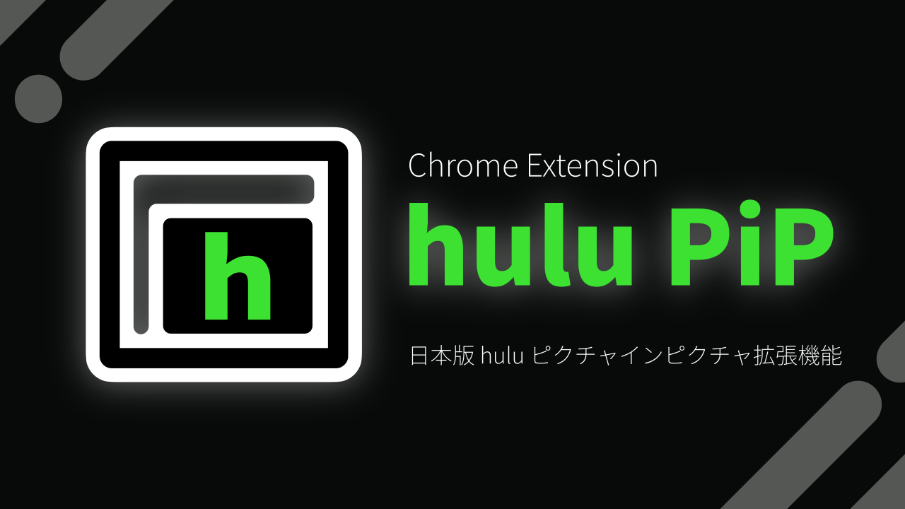

# hulu PiP
日本版 hulu 向けピクチャー イン ピクチャー Chrome / Edge 拡張機能



他の拡張機能では対応していなかった日本版 hulu の動画を、ピクチャー イン ピクチャー (PiP) で視聴できる非公式の Chrome / Edge 拡張機能です。  
PiP ウィンドウは常に他のウィンドウの上に重ねて表示されるので、他のサイトや他のアプリケーションで作業をしながら hulu の動画を視聴できます。

## 📦 導入方法
1. このリポジトリをクローン
2. 以下のコマンドを実行
   ```sh
   $ npm run build
   $ npm install
   ```
3. Chrome / Edge で拡張機能のページ ([chrome://extensions](chrome://extensions)) を開き、**開発者モード**をオンにする
4. **展開して読み込み**からクローンしたフォルダを選択

## ✅ ToDo
- [ ] 動画切り替わり時の対応
- [ ] 「本編へスキップ」ボタン
- [ ] hulu 以外のサイトでアイコンを無効状態にする
- [ ] ブラウザのバージョン判定
- [ ] 字幕対応
- [x] TypeScript で書き直し
- [ ] Chrome ウェブストアに公開 
